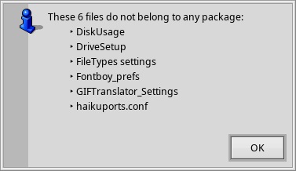

* * *
This repository is in archived, read-only mode.
OpenOriginPackage development continues at [Codeberg](https://codeberg.org/humdinger/OpenOriginPackage).
* * *

##  Open Origin Package
for [Haiku](https://www.haiku-os.org)

'_Open Origin Package_' is a Tracker Add-On that finds the package(s) of any selected file(s) and opens it in the preferred application.  
By default that is HaikuDepot where you can look at its description or the 'Contents' tab to see what other files are part of that package and where they are.

In case files did not belong to any package, you're informed by an alert:

A similar alert is shown if the origin package of a file has been uninstalled.

### Building and installing

A simple '_make_' will build the add-on. A following '_make bindcatalogs_' will add the localized strings.  
To be able to use '_Open Origin Package_', copy it to _/system/non-packaged/add-ons/Tracker/_

'_Open Origin Package_' is also available from HaikuDepot.

### Adding translations

Thanks to Briseur (fr), miqlas (hu), unspacyar (es), Victor Domingos (pt) for providing localizations!  
If you want to help out by adding more translations, please do so at [Polyglot](https://i18n.kacperkasper.pl). There you'll find '_Open Origin Package_' and many other applications in need of new/updated translations.
